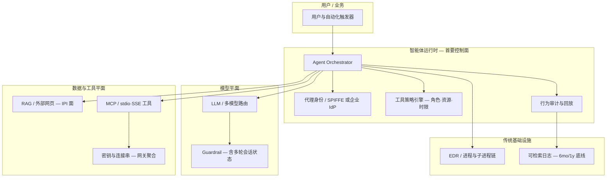

# 全球 AI 安全态势综合观察报告（CISO 技术版）

**观察周期**：2026-04-28 ～ 2026-05-29（东八区）  
**受众**：CISO、安全架构师、AI/应用安全负责人、威胁情报与合规团队  
**素材基础**：`AI安全新闻` 分支 **32 期**《全球网络安全简报（AI 专题）》及其中可核实公开来源  
**版本**：v1.0 · 2026-05-29

---

> **飞来峰上千寻塔，闻说鸡鸣见日升。**  
> **不畏浮云遮望眼，自缘身在最高层。**  
> —— 王安石《登飞来峰》
>
> AI 安全噪声日增，单点漏洞与模型评测分数如「浮云」掠过视野；唯有把控制面抬升到**智能体运行时、编排供应链与可审计证据链**之上，方能在变局中看清攻防与监管同频换轨的方向。本报告即试图为技术决策者提供这样一层「登高」视角。

---

## 执行摘要（技术结论）

| # | 结论 | 技术含义 |
|---|------|----------|
| 1 | **风险重心已迁移** | 约 **32 期 × 日均 7～8 条**要点中，「AI 自身安全」类标签显著多于纯「模型对齐」叙事；**编排层 / MCP / CI·网关** 的 CVE 与无 CVE 事件并存，需独立登记 |
| 2 | **提示注入进入「执行原语」阶段** | 间接注入（IPI）在野可观测；多轮对话使 ASR 相对单轮基准**放大一个数量级**（Cisco 对 15 款前沿模型测评）；Semantic Kernel 等框架出现 **提示词→RCE** 链路 |
| 3 | **供应链=密钥聚合点** | LiteLLM、Flowise、TeamPCP/UNC6780 等案例表明：**统一 AI 网关** 与传统软件供应链叠加后，一次投毒可横向收割多模型 API 密钥 |
| 4 | **对手 AI 化有证据链** | GTIG（2026-05-11）称**首次**在野观察到生成式 AI 参与零日武器化；与防御侧 Big Sleep、Glasswing 等「AI 挖洞/修洞」形成**同源能力竞赛** |
| 5 | **未来 12～24 个月主轴** | **Agent 身份与工具治理**、**多轮/跨会话红队**、**AI-SPM + 日志事实标准**、**跨境合规证据链** 将压过「仅买更强模型」策略 |

---

## 一、观察方法与数据说明

### 1.1 语料范围

- **时间**：32 个自然日（缺 2026-05-03 期，与节假日/采集节奏一致）。
- **筛选**：各期简报遵循「过去 48～72 小时可核实来源」原则；本报告对跨期重复事件**去重合并**，保留首次披露日与最强技术细节。
- **分类标签**（简报内 `📌 类型` 统计，含空格变体）：

| 类别 | 条目约数 | 解读 |
|------|----------|------|
| AI 自身安全 | ~106 | 提示注入、智能体权限、治理、多轮越狱 |
| AI 赋能安全 | ~88 | SOC/检测、红队框架、AI 辅助漏洞研究 |
| AI 基础设施 CVE | ~60 | 网关、编排框架、推理运行时、MCP |

> 上述为关键词命中计数，单条可含复合类型；用于说明**议题重心**，非严格加权评分。

### 1.2 置信度标注（全文适用）

- **【A】** 多源交叉或 NVD/政府通报  
- **【B】** 单一权威媒体 + 厂商博客  
- **【C】** 厂商单方或预印本，需独立复现  

---

## 二、架构视角：攻击面从「模型」扩展到「代理栈」

### 2.1 分层攻击面模型（LASM）

arXiv 预印本《A Systematic Survey of Security Threats and Defenses in LLM-Based AI Agents》【C】提出 **Layered Attack Surface Model（LASM）**：将工具执行、记忆、MCP 生态、多智能体协作与**跨会话时间维度**拆开——与 4 月底以来简报中的事件高度同构。

*图 1：智能体安全研究社群对「模型之外」控制面的系统化归纳（预印本，引用需标注未同行评议）。*

### 2.2 企业参考架构（防御落点）

**技术要点**：微软在 Semantic Kernel 双 CVE 处置文中明确——**「LLM 不是安全边界」**【B】；模型输出到工具参数的路径应视为**攻击者可控输入**，主机层 EDR 与异常子进程狩猎不可省略。

*图 2：产业方将「提示词→Shell/RCE」纳入智能体框架威胁模型的公开叙事（Microsoft Security Blog）。*

---

## 三、五大技术趋势（深读）

### 趋势 1：提示注入 — 从内容滥用到「执行原语」

**现象链**

1. **在野 IPI 可观测**【B】：Google GTIG 基于 Common Crawl 扫描，2025-11 至 2026-02 恶意类 IPI 检出相对上升约 **32%**（4-28 简报）；Forcepoint 等独立狩猎互证。  
2. **CI/PR 运行时事故**【B】：「Comment and Control」—— 恶意指令嵌入 GitHub PR 标题，触发 Claude Code Security Review、Gemini CLI Action、Copilot Agent 将密钥写入评论（4-28）。  
3. **多轮放大**【B】：Cisco 2026-05-28 测评 **15 款**前沿模型，**30,090** 条单轮 + **6,986** 条多轮提示；多轮 ASR **7.89%～88.30%**，远高于单轮 **2.19%～64.91%**（例：Gemini 3 Pro 单轮 18.1% → 多轮 **73.3%**）。  
4. **框架级 RCE**【A】：Semantic Kernel **CVE-2026-26030**（Python `eval` sink + 默认向量检索插件）、**CVE-2026-25592**（.NET 沙箱穿越写主机路径）；修复阈值 Python **≥1.39.4**、.NET **≥1.71.0**（5-11 简报）。

*图 3：在野间接提示注入监测方法论（Google Online Security Blog，2026-04）。*

**工程结论**

- 单轮 HarmBench/AILuminate 分数**不足以**支撑采购决策；必须增加**多轮、跨会话、带工具状态**的红队。  
- RAG/网页/CRM 备注/语音座席上下文均为**同级不可信输入**；Outpost24、Caller Digital 等强调**架构隔离**优于 regex（5-12～13 简报）。

---

### 趋势 2：MCP 与编排层 — 「导入即 RCE」的新供应链

**代表性技术事件**

| 时间 | 事件 | 机制 | 缓解方向 |
|------|------|------|----------|
| 05-29 | Flowise **CVE-2026-40933** | 恶意 **stdio MCP** 写入共享 chatflow JSON，导入即服务端 RCE | 禁用 stdio、`CUSTOM_MCP_PROTOCOL=sse`、签名校验 flow |
| 05 上旬 | LiteLLM / TeamPCP | PyPI 投毒 + 恶意 PR + GHA 滥用 → **SANDCLOCK** 窃密 | 网关隔离、密钥分片、供应链签名 |
| 05-07 | MCP「配置即执行面」 | 协议把本地/云端工具连成默认路径 | 字段级沙箱、出站网络默认拒绝 |

*图 4：MCP 将工具调用标准化——同时标准化了攻击者的「工具投毒」面。*

.avif)

*图 5：编排平台「共享 JSON 导入」成为无 CVE 编号的新型供应链入口（2026-05-28）。*

---

### 趋势 3：智能体身份、零信任与运行时治理产品化

- **Xage Agent Sentry / Resource Gateway**（05-29）【C】：为每个代理分配数字身份，约束网络/OS 调用，识别影子 AI 代理。  
- **OWASP FinBot**（05-29）【B】：金融场景 CTF，覆盖间接投毒、MCP 描述篡改、工具滥用，对齐 **OWASP Top 10 for Agentic Applications 2026**。  
- **CSA OpenClaw 建议**（05-28）【A】：新加坡 CSA 要求权限、人工监督、日志审计纳入代理试点准入。  
- **CISA 智能体 AI 安全指引**（5 月多篇简报互引）【A】：将 Agentic AI 纳入国家关键基础设施对话。

*图 6：多国机构把「智能体工作流」从实验提升为正式威胁建模类别。*

*图 7：零信任厂商将「代理身份」作为与「用户身份」并列的控制维度（2026-05-27/29 相关报道）。*

---

### 趋势 4：AI 赋能防御 — 与对手同源的能力竞赛

**防御侧**

- **联邦日志现代化**：OMB **M-26-14**（05-22）【A】取代 M-21-31，要求 CISA **90 日内**制定新日志参考架构（LRA），并研究 **AI 增强监测/取证**；可检索日志保留 **6 个月**、记录 **1 年**。  
- **AI 辅助漏洞闭环**：Google **Big Sleep / CodeMender**、Anthropic **Project Glasswing / Mythos**（05-13）【B】。  
- **SOC 智能体化**：Darktrace、Microsoft「AI SOC 领导力」象限等【C】—— 价值取决于是否与身份、日志、变更审计**同一事实标准**对接。

**威胁侧**

- GTIG《AI Threat Tracker》（05-13）【B】：**PROMPTSPY**、APT 批量递归 CVE 提示、**AI 辅助零日**（Python 利用链，针对开源 2FA 绕过逻辑）。  

*图 8：威胁情报官方叙事从「模型滥用」扩展到「漏洞研究工业化」。*

*图 9：主流媒体将「AI 参与零日」定义为可公开讨论的证据节点（2026-05-11）。*

**技术判断**：同一能力栈（长上下文 + 工具调用 + 代码生成）在防御方是**缩短 MTTR**，在攻击方是**缩短 TTP**；KPI 应从「模型是否更对齐」转向「**发现—利用—补丁** 半衰期是否恶化」。

---

### 趋势 5：监管与合规 — 证据链前置

- **欧盟 AI Act**【A】：2026-05 集中更新指南草案与 **AI omnibus** 政治协议；透明度义务 **2026-08** 生效节点、高风险系统分期至 **2027～2028**（05-17、05-24 简报）。  
- **美国**：科罗拉多 **SB 189** 将 AI 法生效推迟至 **2027-01-01** 并缩减义务（05-29）；联邦侧 CAISI、前沿模型测评叙事并行（05-09、05-23）。  

*图 10：监管对话的锚点仍是「风险分级 + 可审计义务」，而非单一模型版本。*

*图 11：社区框架（OWASP GenAI）与监管时间轴同步加速（2026 Q1 报告）。*

---

## 四、时间轴：32 日关键锚点（技术向）

| 日期 | 锚点事件 | 标签 |
|------|----------|------|
| 04-28 | Google 在野 IPI 扫描；GPT-5.5 安全叙事；Comment and Control | IPI / 供应链 |
| 04-30 | LiteLLM 等网关 CVE 与 IPI 综述同框 | 基础设施 |
| 05-07 | MCP 配置执行面；Semantic Kernel 双 RCE CVE | 框架 RCE |
| 05-11 | LASM 预印本；Semantic Kernel 官方狩猎指南 | 研究/处置 |
| 05-13 | GTIG：AI 助零日首证 + LiteLLM 供应链 + OpenClaw 技能 | 威胁情报 |
| 05-14 | 疑似 AI 辅助零日利用进入政府漏洞摘要叙事 | 对手 tempo |
| 05-17 | 欧盟 AI omnibus 时间表细化 | 合规 |
| 05-22 | OMB M-26-14 联邦日志与 AI 检测 | 防御制度化 |
| 05-28 | Cisco 多轮注入测评；Flowise CVE；CSA OpenClaw | 测评/编排 |
| 05-29 | Xage 代理零信任；OWASP FinBot；科罗拉多法修订 | 治理产品化 |

---

## 五、未来 12～24 个月安全技术方向（研判）

### 5.1 控制面：从 AppSec 到「AgentSec」

| 能力域 | 现在（2026 Q2） | 12～24 个月主流形态 |
|--------|-----------------|---------------------|
| 身份 | 用户 SSO | **每代理一身份** + 短期凭证 + 工具 scope |
| 策略 | 提示过滤 | **工具调用 PDP**（策略决策点）+ 人工闸门 |
| 检测 | 单轮越狱测试 | **多轮/跨会话** 攻击模拟 + 运行时行为 UEBA |
| 漏洞管理 | 仅 NVD CVE | **AI 编排资产登记**（flow JSON、MCP 描述、技能包） |
| 日志 | 应用日志 | **代理决策链** 可检索、可回放（对齐 M-26-14 类要求） |

### 5.2 评测与采购：反「单轮安全洗白」

- 将 **multi-turn ASR**、**tool-use abuse**、**IPI from RAG** 写入 RFP 与上线闸门【B】。  
- 模型卡/System Card 需索取：**工具层**与**流水线层**披露，而非仅有害内容分类分数（4-28 VentureBeat 审计视角）。

### 5.3 威胁情报：AI 基础设施作为高价值目标

- 统一网关、推理运行时（Ollama 等）、IDE 代理链将继续出现**传统漏洞分类**（内存越界、SSRF、XSS）与**无 CVE 事件**（Comment and Control）并存——需维护**平行登记册**。

### 5.4 合规：可证明性 > 原则宣言

- 欧盟透明度与高风险管理将迫使企业提前建设：**模型变更日志、人工监督记录、第三方测试证据**（05-15、05-24 趋势句共识）。  
- 跨国企业须做法域**交叉映射**（EU / US 联邦 / US 州法 / 亚太通报），避免「只盯单一法域」盲区。

### 5.5 防御技术投注建议（优先级）

1. **P0**：代理工具最小权限 + 密钥分片 + 编排制品签名  
2. **P0**：多轮红队与 FinBot 类演练环境常态化  
3. **P1**：AI-SPM（发现影子 AI、未纳管代理）与 SIEM 关联  
4. **P1**：日志 LRA 对齐（6mo/1y）与代理审计字段标准化  
5. **P2**：专用「网安大模型」与 SOC 智能体—— 以**可解释分诊**为采纳门槛，非自动化幅度  

---

## 六、CISO 技术行动清单

### 30 天

- [ ] 清点 **LiteLLM / Flowise / Semantic Kernel / OpenClaw** 等暴露实例与版本  
- [ ] 对生产代理启用 **MCP SSE-only** 或等效隔离；禁用未审计 stdio  
- [ ] 将 **多轮提示注入** 纳入上线前测试（可参考 Cisco 测评维度设计内部基准）  
- [ ] 建立 **无 CVE 事件** 响应模板（PR 标题注入、恶意 flow 导入）

### 90 天

- [ ] 部署 **代理身份 + 工具 PDP**（商用或零信任厂商方案）  
- [ ] OWASP **LLM01 / Agentic Top 10** 对照表转 RACI  
- [ ] SIEM 增加 **代理子进程链、异常工具调用** 用例（参考微软狩猎查询改写）  
- [ ] 欧盟 AI Act **2026-08** 透明度义务差距评估（若涉欧业务）

### 180 天

- [ ] **AI 编排资产**纳入 CMDB 与漏洞扫描范围  
- [ ] 红队年度剧本包含 **供应链技能包 / MCP 描述篡改 / 跨会话记忆投毒**  
- [ ] 董事会指标：**密钥聚合点数量↓**、**多轮红队 ASR↓**、**代理审计覆盖率↑**

---

## 七、局限性与引用说明

- 本报告为简报**二次综合**，不替代原始法律意见或渗透测试报告。  
- 厂商产品图与测评数据标注【B】【C】处，实施前须独立验证。  
- 配图版权归原发布方所有；本报告仅作内部研判引用。  
- 完整逐日条目见仓库分支 `AI安全新闻` / 目录 `briefings/`。

---

## 附录 A：高频一手来源（节选）

| 主题 | 来源 |
|------|------|
| 在野 IPI | [Google Security Blog, 2026-04](https://security.googleblog.com/2026/04/ai-threats-in-wild-current-state-of.html) |
| GTIG AI Threat Tracker | [Google Cloud Blog, 2026-05](https://cloud.google.com/blog/topics/threat-intelligence/ai-vulnerability-exploitation-initial-access) |
| 多轮注入测评 | [Cisco Blogs, 2026-05](https://blogs.cisco.com/ai/proprietary-problems) |
| Agent 框架 RCE | [Microsoft Security Blog, 2026-05](https://www.microsoft.com/en-us/security/blog/2026/05/07/prompts-become-shells-rce-vulnerabilities-ai-agent-frameworks/) |
| Flowise CVE | [Obsidian Security, 2026-05](https://www.obsidiansecurity.com/blog/when-is-stdio-mcp-actually-a-vulnerability) |
| OWASP FinBot | [SC Media, 2026-05](https://www.scmagazine.com/news/owasp-launches-finbot-to-help-developers-secure-ai-agents) |
| 联邦日志 M-26-14 | [Industrial Cyber, 2026-05](https://industrialcyber.co/regulation-standards-and-compliance/omb-cyber-directive-pushes-centralized-logging-ai-driven-detection-to-counter-cyber-threats-across-iot-and-ot-systems) |
| LASM 预印本 | [arXiv 2604.23338v2](https://arxiv.org/html/2604.23338v2) |

---

## 附录 B：术语速查

| 术语 | 含义 |
|------|------|
| IPI | Indirect Prompt Injection，通过外部内容注入指令 |
| MCP | Model Context Protocol，模型—工具连接协议 |
| ASR | Attack Success Rate，攻击成功率 |
| LASM | Layered Attack Surface Model，智能体分层攻击面 |
| AI-SPM | AI Security Posture Management，AI 安全态势管理 |
| THIRF | Threat Hunting & Incident Response Forensics（M-26-14 语境） |

---

*报告结束 · 编制：全球 AI 安全日报综合观察（Cloud Agent）*
